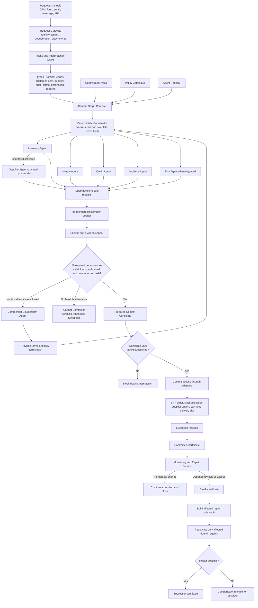
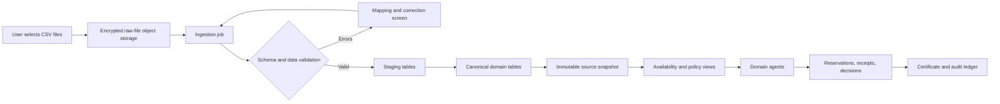
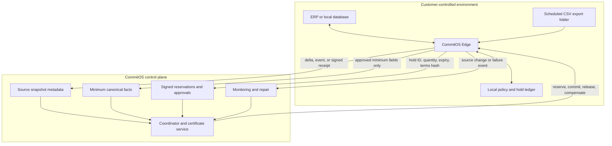
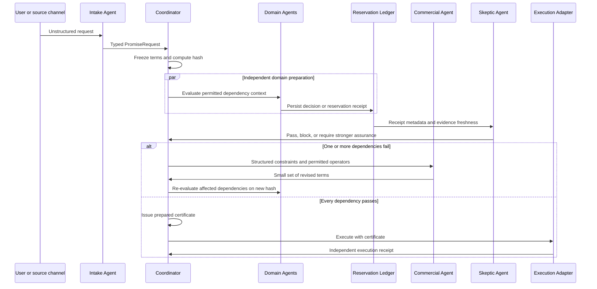
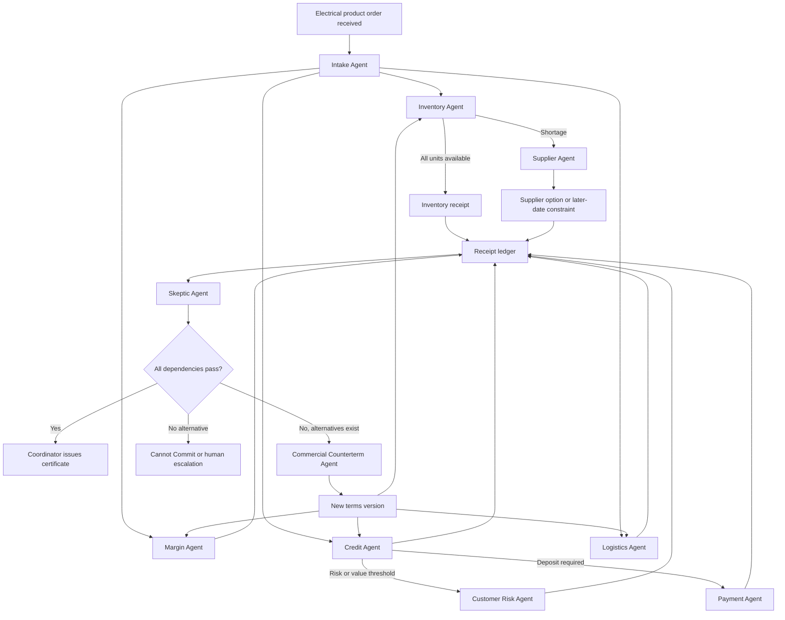

# CommitOS Product Flow, Agent Council, and Pitch Deck

**Document purpose:** Define how CommitOS works end to end, which agents participate, how data moves and stays current, and how to pitch the product honestly before the working platform exists.

**Primary audience:** Design partners, operations leaders, commercial leaders, finance leaders, supply-chain leaders, and early backers.

**Document status:** Product blueprint and pitch narrative.

**Last updated:** August 30, 2026.

---

## 1. Product in One Sentence

> CommitOS prevents a company from making a customer promise until every required operational dependency is backed by current evidence, an authorized approval, or an expiring reservation tied to the exact same terms.

CommitOS sits above systems such as CRM, ERP, warehouse, supplier, finance, and logistics platforms. It does not replace those systems. It coordinates them before a promise becomes binding.

The product's main output is a **Commit Certificate**: a machine-verifiable authorization showing that inventory, margin, credit, supply, delivery, and any other required dependencies support one exact promise.

---

## 2. What Exists Today and What Is Still Future Product

### Available today in this repository

- A detailed product and architecture specification.
- Eight synthetic ERP-style CSV datasets for an electrical-products distributor.
- A proposed per-certificate revenue model.
- A worked end-to-end product scenario.

### Not implemented yet

- Web application and user authentication.
- Cloud or customer-hosted database.
- File-ingestion pipeline.
- Agent runtime and tool permissions.
- Reservation ledger.
- Deterministic transaction coordinator.
- Commit Certificate generation and validation.
- Local Edge connector and continuous synchronization.
- ERP write-back, payment, or logistics reservation connectors.

The first demonstration must therefore be presented as a **planned product backed by a concrete architecture and test dataset**, not as a functioning production system.

---

## 3. End-to-End Product Flow

### 3.1 Complete operating flow



### 3.2 The decisive product rule

```text
No valid, current Commit Certificate
                    =
No binding downstream promise or execution action
```

The certificate cannot be a decorative report. The order-confirmation, quote-release, booking, payment, or production tool must reject execution when the certificate is missing, expired, broken, or tied to different terms.

---

## 4. Data Upload, Storage, and Synchronization Flow

### 4.1 Hosted file-upload mode



An uploaded file is a **point-in-time snapshot**. Uploading it does not create a permanent connection to the original file on the user's laptop. A changed local file must be uploaded again unless CommitOS Edge or a direct source connector is installed.

### 4.2 Production synchronization modes



### 4.3 Assurance by connection type

| Data mode | How it updates | Can it create a real hold? | Certificate assurance |
|---|---|---:|---|
| Manual upload | User uploads another file | Only inside CommitOS | Snapshot observation plus CommitOS-native hold |
| Watched export folder | Edge detects a new file and publishes a new snapshot | Local overlay hold; source protection depends on workflow discipline | Source-local observation plus local hold |
| Local database adapter | Edge queries and mutates an approved local database | Yes, when the source supports reservations | Source-backed approval or hard hold |
| ERP/API connector | API reads, reserves, commits, and releases | Yes | Source-backed hard hold |
| Event or CDC connector | Source changes publish near-real-time events | Depends on paired command adapter | Near-real-time evidence and invalidation |
| Human authority | Authorized person signs a typed decision | Only if the person performs the corresponding operational action | Human attestation |

### 4.4 What goes into storage

#### Raw object storage

- Original uploaded files.
- Tenant ID and source ID.
- File checksum.
- Upload time and declared source-extraction time.
- Encryption and retention metadata.

#### Canonical operational database

- Materials and resources.
- Inventory observations.
- Supplier options.
- Customer credit and risk observations.
- Margin and pricing policies.
- Logistics routes and capacity windows.
- Promise requests and terms versions.
- Dependency graphs.
- Agent runs and typed decisions.
- Reservations and reservation receipts.
- Certificates and certificate lineage.
- Execution, release, compensation, and repair events.
- Synchronization cursors and source health.

#### What the web interface receives

The browser should receive purpose-built, role-filtered API responses. It should not download every raw CSV or expose one domain's confidential data to another domain.

Examples:

- Sales sees `margin approved` and the permitted price band, not the complete cost ledger.
- Finance sees customer exposure and requested payment terms, not confidential supplier quotations.
- Inventory sees item, quantity, location, and existing holds, not customer lifetime value.
- The coordinator sees a signed `credit held` receipt, not the customer's full payment history.

### 4.5 Synchronization and invalidation algorithm

1. Detect a new export, API event, database change, or manual upload.
2. Assign a source version and calculate a checksum.
3. Validate schema, identifiers, units, duplicates, and required fields.
4. Load data into staging.
5. Publish the new canonical snapshot in one database transaction.
6. Compare changed resources with active reservations and certificates.
7. Publish invalidation events for affected dependencies.
8. Mark evidence stale when its freshness limit expires.
9. Break certificates when a required dependency is no longer valid.
10. Run a selective repair graph rather than restarting every agent.

Every mutation uses an idempotency key:

```text
tenant + request + certificate version + dependency + action
```

This prevents retries from creating duplicate holds, orders, charges, releases, or compensations.

---

## 5. Current Dataset Mapping

| File | Canonical purpose | Primary agent users | Important ingestion rule |
|---|---|---|---|
| `MARA_material_master.csv` | Product catalogue | Intake, Inventory | Key by material ID; add weight and dimensions |
| `MARD_inventory_stock.csv` | Warehouse availability snapshot | Inventory | Treat `LABST` consistently; do not double-subtract open orders |
| `VBAK_open_orders.csv` | Sales backlog and order context | Inventory, Risk, Commercial | Exclude completed status `C` from open backlog calculations |
| `KNKK_customer_credit.csv` | Credit limit and exposure | Credit | Treat financial details as restricted context |
| `MBEW_margin_rules.csv` | Cost, floor margin, floor price | Margin | Resolve plant-specific policy scope |
| `LFA1_suppliers.csv` | Supplier price, capacity, lead time, reliability | Supplier, Skeptic | Add option expiry, source location, and reservation capability |
| `TVRO_logistics_routes.csv` | Route capacity and next slot | Logistics | Add dated capacity schedules and item weight |
| `KNKK_RISK_customer_risk.csv` | Dispute, payment, and customer-risk context | Risk | Activate only under policy-defined conditions |

### Data gaps required for the credible demonstration

- Product weight and dimensions.
- Customer ship-to location and route zone.
- Snapshot extraction time.
- Supplier origin and option expiry.
- Payment or deposit authorization source.
- Real reservation, release, and compensation tables.
- Dated route-capacity schedule.
- Clear treatment of open orders versus unrestricted inventory.
- Plant-specific cost and price policy when applicable.

---

## 6. Agent Design Principles

### 6.1 What qualifies as an agent

A domain should be implemented as an agent only when it has:

- An independent operational objective.
- Distinct private context.
- Explicit authority or veto power.
- Tools it is permitted to use.
- A need to interpret ambiguity or propose bounded alternatives.

Arithmetic, schema validation, transaction state, hashes, freshness checks, and certificate validity should remain deterministic services.

### 6.2 How agents interact

Agents do not share one unrestricted conversation.



### 6.3 Required agent output

Every operational decision conforms to a typed schema similar to:

```yaml
domain_decision:
  request_id: PR-2041
  dependency_id: DEP-INVENTORY-01
  domain: inventory
  decision: held
  covered_terms_hash: sha256:3fa58147...
  quantity_or_limit: 327
  valid_until: 2026-08-30T17:00:00+05:30
  policy_version: INV-ALLOCATION-2.1
  authority_id: inventory-authority
  assurance_level: native_hold
  receipt_id: INV-HOLD-101
  explanation_code: INVENTORY_PARTIAL_QUANTITY_HELD
```

Free-form explanations can accompany this object, but free-form text cannot create operational truth.

---

## 7. Proposed Agent Council

### 7.1 Agent activation summary

| Agent | Activation | Core authority | Typical output |
|---|---|---|---|
| Intake and Interpretation | Every unstructured request | Interpret, not approve | Typed `PromiseRequest` |
| Inventory and Allocation | Physical item or scarce resource requested | Observe, hold, release inventory | Inventory receipt or shortfall |
| Margin and Pricing | Price, discount, or supplier-cost change | Approve price within policy | Margin approval or allowed price floor |
| Credit and Exposure | Deferred payment or credit use | Reserve or reject exposure | Credit receipt or payment counterterm |
| Logistics and Delivery | Delivery location or deadline exists | Reserve route or delivery capacity | Route receipt or feasible date |
| Supplier and Procurement | Internal shortfall or external supply required | Hold supplier option | Supplier receipt or alternative source |
| Customer Risk | Value, risk, dispute, or policy trigger | Require stronger terms or block | Risk approval, deposit, or escalation |
| Payment and Deposit | Advance payment or authorization required | Authorize or confirm funds | Payment authorization receipt |
| Capacity and Production | Make-to-order or processing capacity required | Hold machine, line, or work-center capacity | Capacity receipt or split schedule |
| Quality and Compliance | Regulated item, quality condition, or exception | Approve evidence and compliance conditions | Approval or human escalation |
| Commercial Counterterm | One or more domains reject but alternatives are permitted | Propose bounded revised terms | Candidate term set |
| Skeptic and Evidence | Before certificate; high-risk cases; repair | Challenge freshness, completeness, and assurance | Pass, block, or stronger-evidence request |

For the electrical-distributor MVP, the initial set should be:

1. Intake and Interpretation.
2. Inventory and Allocation.
3. Margin and Pricing.
4. Credit and Exposure.
5. Logistics and Delivery.
6. Supplier and Procurement, activated dynamically.
7. Customer Risk, activated conditionally.
8. Commercial Counterterm.
9. Skeptic and Evidence.

Payment, Capacity, and Quality agents can be added when the pilot promise type requires them.

### 7.2 Intake and Interpretation Agent

**Activated when:** The source request contains natural language, an attachment, an email, or incomplete structured fields.

**May read:** Original request, attachments, product catalogue labels, customer-facing terminology, and normalization rules.

**May do:**

- Extract product, quantity, price, payment terms, destination, and deadline.
- Normalize units, dates, currencies, and customer identifiers.
- Mark ambiguous or missing fields.
- Request clarification when ambiguity changes feasibility.

**Returns:** A typed `PromiseRequest`, confidence, and evidence spans.

**Must never:** Approve a request, reserve a resource, or infer missing commercial terms as facts.

### 7.3 Inventory and Allocation Agent

**Activated when:** A physical item, room, seat, material, or other unit resource is requested.

**May read:** SKU, quantity, permitted locations, unrestricted availability, existing CommitOS holds, and allocation policy.

**May do:**

- Query current availability.
- Place expiring holds.
- Split allocation across permitted locations.
- Release its own holds.
- Return exact shortages and permitted substitutions.

**Returns:** Held quantity, reservation IDs, expiry, assurance, or a structured shortfall.

**Must never:** Change price, approve customer credit, or expose stock belonging to another tenant.

### 7.4 Margin and Pricing Agent

**Activated when:** Price, discount, supplier cost, service level, or scope affects profitability.

**May read:** Requested price, permitted cost inputs, floor margin, approval bands, and supplier-cost consequences.

**May do:**

- Calculate deterministic margin.
- Approve within delegated limits.
- Return minimum feasible price.
- Escalate exceptions to an authorized pricing manager.

**Returns:** Approval, rejection, permitted price band, policy version, and explanation code.

**Must never:** Reveal the complete cost ledger to Sales or change customer credit policy.

### 7.5 Credit and Exposure Agent

**Activated when:** The customer requests deferred payment, credit, a guarantee, or another exposure-bearing term.

**May read:** Customer identity, credit limit, current exposure, relevant payment terms, and risk category.

**May do:**

- Calculate remaining headroom.
- Reserve credit exposure when the source supports it.
- Reject excess exposure.
- Return permitted deposit or payment alternatives.

**Returns:** Credit receipt, exposure held, expiry, or payment counterterm.

**Must never:** See confidential supplier prices or override a blacklist without human authority.

### 7.6 Logistics and Delivery Agent

**Activated when:** A promise includes delivery location, date, SLA, or carrier condition.

**May read:** Origin, destination zone, shipment weight and dimensions, route schedules, available capacity, and delivery policy.

**May do:**

- Calculate feasible dispatch and arrival dates.
- Reserve route or carrier capacity.
- Split shipments when allowed.
- Return feasible delivery alternatives.

**Returns:** Route receipt, capacity held, expected dates, expiry, or missing-evidence result.

**Must never:** Invent weight, destination, or route capacity when the source does not provide it.

### 7.7 Supplier and Procurement Agent

**Activated when:** Inventory, material, or capacity agents discover an internal shortfall.

**May read:** Item, shortage quantity, needed-by date, permitted suppliers, lead time, available capacity, reliability, and supplier price.

**May do:**

- Compare permitted supplier options.
- Place an expiring supplier option.
- Identify minimum order and lead-time constraints.
- Suggest an alternative supplier or date.

**Returns:** Supplier-option receipt, quantity, price effect, expected date, and expiry.

**Must never:** Expose confidential quotations to unauthorized commercial users.

### 7.8 Customer Risk Agent

**Activated when:** Deal value, dispute history, late-payment rate, blacklist status, geography, or policy exception crosses a configured threshold.

**May read:** Approved risk attributes, dispute history, lateness, fraud or blacklist flags, and current request value.

**May do:**

- Require stronger assurance.
- Require advance payment, guarantee, or human review.
- Reject blacklisted or prohibited requests.

**Returns:** Risk approval, counterterm, rejection, or authorized escalation.

**Must never:** Share detailed risk history outside permitted roles.

### 7.9 Payment and Deposit Agent

**Activated when:** A deposit, advance payment, authorization, or refund is required.

**May read:** Amount, currency, payment method token, authorization status, and refund policy.

**May do:**

- Create or validate an authorization.
- Capture funds at the correct commit stage.
- Void or refund according to policy.

**Returns:** Payment authorization or execution receipt.

**Must never:** Store raw card credentials or capture funds without a valid transaction state.

### 7.10 Capacity and Production Agent

**Activated when:** The promise requires manufacturing, assembly, customization, installation, or scarce work-center time.

**May read:** Required output, routing, shifts, work centers, maintenance windows, and existing holds.

**May do:**

- Hold capacity windows.
- Propose a split schedule.
- Return a feasible completion date.

**Returns:** Capacity receipt or bounded schedule alternative.

**Must never:** Approve commercial price or customer exposure.

### 7.11 Quality and Compliance Agent

**Activated when:** Product, customer, jurisdiction, quality, regulatory, or contractual conditions require independent evidence.

**May read:** Required certifications, quality records, policy rules, and permitted evidence.

**May do:**

- Validate evidence.
- Require an authorized human sign-off.
- Reject missing or expired compliance documentation.

**Returns:** Approval, evidence receipt, rejection, or escalation.

**Must never:** Treat an unsupported narrative as compliance proof.

### 7.12 Commercial Counterterm Agent

**Activated when:** Original terms fail, but policy allows bounded alternatives.

**May read:** Customer-facing terms, structured constraint codes, allowed term operators, permitted price bands, and non-sensitive feasibility summaries.

**May do:**

- Propose a small candidate set.
- Change only permitted terms such as price, deposit, date, quantity, split delivery, location, or substitution.
- Rank feasible candidates using declared commercial priorities.

**Returns:** Revised candidate terms with expected customer impact.

**Must never:** Invent unsupported contract terms, reuse old terms-dependent receipts, or override a domain veto.

### 7.13 Skeptic and Evidence Agent

**Activated when:** Preparation is nearly complete, evidence is weak, a high-risk policy triggers, or repair begins.

**May read:** Receipt metadata, evidence age, assurance level, dependency coverage, reservation expiry, policy versions, and declared compensation paths.

**May do:**

- Detect stale evidence.
- Detect double counting or inconsistent quantities.
- Identify missing dependencies.
- Require stronger assurance.
- Block preparation and request human review.

**Returns:** Pass, block, stronger-evidence request, or escalation.

**Must never:** Create a reservation or substitute its opinion for a deterministic policy result.

---

## 8. Components That Are Not Agents

| Component | Why it must remain deterministic |
|---|---|
| Request Gateway | Authentication, tenancy, deduplication, and provenance must be predictable |
| Commit Graph Compiler | Dependency rules come from configuration and policy |
| Policy Engine | Financial, legal, and operational limits need versioned calculations |
| Transaction Coordinator | Terminal state, retries, and expiry cannot depend on model judgment |
| Reservation Ledger | Operational history must be immutable and independently auditable |
| Certificate Service | Hash, signature, validity, and lineage must be machine-verifiable |
| Monitoring and Repair Service | Event routing and affected-subgraph selection must be reliable |
| CommitOS Edge | Source access, local permissions, idempotency, and data minimization are infrastructure concerns |
| Human Authority Portal | Human approval is a typed, signed event, not an AI persona |

The governing principle is:

> Agents reason about bounded domain problems. Deterministic services govern money, state, permissions, reservations, and certificate validity.

---

## 9. Agent Activation Flow for the Electrical-Products Pilot



---

## 10. Data-Backed Demonstration Scenario

### Original request

> Supply 400 `MAT-10008` Crompton 3-Phase Motor 5HP units to `CUST-1006` at ₹14,500 per unit on Net 30, delivered to Hyderabad by September 5, 2026.

### Initial deterministic results

| Dependency | Dataset evidence | Result |
|---|---|---|
| Inventory | 204 Mumbai + 51 Delhi + 72 Bengaluru = 327 | Reject: short by 73 |
| Margin | Cost ₹12,092.29; floor margin 19.4%; floor price ₹15,002.84 | Reject: requested margin is 16.60% |
| Credit | ₹50 lakh limit − ₹28.45 lakh exposure = ₹21.55 lakh headroom | Reject: ₹58 lakh request exceeds headroom |
| Supplier | `VEND-2005` has 242 units available and five-day lead time | Can cover 73-unit shortage |
| Logistics | Hyderabad routes exist, but item weight is missing | Missing evidence; cannot claim feasibility |
| Risk | Customer is low-risk but deal value is high | Policy-dependent approval or skeptic review |

No certificate is issued for the original terms.

### Bounded counterterm

- Price increases to ₹15,500 per unit.
- 70% advance payment is required.
- 327 units deliver from existing stock by September 5.
- 73 units deliver from supplier-backed stock by September 10.
- A demo-only weight assumption of 25 kg per unit is made explicit in configuration.

### Revised deterministic results

- Margin becomes 21.99%, above the 19.4% floor.
- Total value becomes ₹62 lakh.
- Advance payment becomes ₹43.4 lakh.
- Remaining credit exposure becomes ₹18.6 lakh, within headroom.
- Inventory and supplier options cover all 400 units.
- Three Hyderabad route allocations cover the on-hand stock under the stated weight assumption.
- All new receipts use the revised terms hash.

The coordinator can now issue the prepared certificate, subject to a real or simulated payment authorization and freshness policy.

### Disruption and repair

If `VEND-2005` cancels the 73-unit option:

1. The current certificate becomes `broken`.
2. The 327-unit inventory hold remains preserved if policy allows.
3. Supplier, logistics, commercial, and skeptic agents reactivate.
4. `VEND-2006` can cover the quantity but has a 20-day lead time.
5. CommitOS proposes a later second delivery date.
6. Customer acceptance creates a new terms version.
7. A successor certificate replaces the broken certificate.

---

## 11. Primary Product Screens

1. **Data Sources:** Upload or connect systems, map columns, inspect errors, freshness, and assurance.
2. **Promise Inbox:** See incoming requests, current state, blockers, and expiry countdowns.
3. **Commitment Case:** View exact terms, dependency graph, active agents, and evidence timeline.
4. **Agent Decision Drawer:** Inspect activation reason, authority, policy, receipt, and permitted context.
5. **Counterterm Workspace:** Compare a small number of feasible revised terms.
6. **Commit Certificate:** Inspect terms hash, receipt set, expiry, assurance, and execution gate.
7. **Repair Timeline:** See the fact change, broken certificate, preserved holds, reactivated agents, and successor.
8. **Administration:** Configure packs, policies, agents, connectors, privacy, and human authorities.

The primary case interface should be a dependency graph, not a transcript of agents talking to each other.

---

## 12. Recommended Build Sequence

### Phase 1: Credible interactive demonstration

- Manual upload of the eight CSV files.
- Column mapping and snapshot health.
- One electrical-order promise type.
- Deterministic margin, credit, inventory, and logistics checks.
- CommitOS-native inventory and supplier hold tables.
- Dynamic supplier-agent activation.
- Counterterm and revised terms hash.
- Certificate-gated mock order creation.
- Supplier cancellation and successor certificate.

### Phase 2: Design-partner pilot

- Customer-hosted Edge service.
- Watched export folder or read-only database connection.
- Local idempotency ledger.
- Incremental synchronization and freshness enforcement.
- One real reservation or write-back connector.
- SSO, roles, audit export, and human-authority portal.

### Phase 3: Production commitment control plane

- ERP and source-native reservations.
- Event or CDC invalidation.
- Payment and logistics transaction adapters.
- Multi-tenant or private-cloud deployment.
- Versioned Commitment Packs.
- Operational monitoring, repair, and compensation at scale.

---

# Pitch Deck: CommitOS Design-Partner Story

## Deck communication job

By the end, operations, finance, commercial, and supply-chain leaders should want to test CommitOS on one high-value exception-order workflow because it prevents unsupported customer promises without replacing their existing systems.

The deck should be presented honestly as a product being designed and validated. Current assets are the product specification and synthetic demonstration data; the functioning platform is the next build stage.

---

## Slide 1 — CommitOS

### On-slide copy

**CommitOS**

The authorization layer for business promises.

> Never promise what you have not reserved.

### Suggested visual

One unsupported customer promise on the left; one green Commit Certificate backed by inventory, finance, supply, and delivery on the right.

### Presenter note

CommitOS is not another dashboard or chatbot. It decides whether an exact customer promise is operationally safe and creates the authorization required to release it.

---

## Slide 2 — The promise is made before the facts agree

### On-slide copy

Sales commits the date.

Inventory knows the stock is already allocated.

Finance knows the customer is overexposed.

Suppliers and logistics discover the problem later.

**The customer hears “yes” before the company has coordinated reality.**

### Suggested visual

A customer-facing promise moving forward while four disconnected operational systems show conflicting states.

### Presenter note

The problem is not missing data. The problem is that no cross-domain authorization boundary exists before the promise becomes binding.

---

## Slide 3 — Approval is not reservation

### On-slide copy

**Observation** — the resource existed when checked.

**Approval** — an authorized domain accepted the terms.

**Reservation** — the resource was held for this request.

**Commitment** — every dependency backed the same terms.

Most broken promises happen when an observation or approval is mistaken for a commitment.

### Suggested visual

A four-stage progression ending with a locked certificate.

---

## Slide 4 — Existing systems record parts of the truth

### On-slide copy

CRM records the commercial request.

ERP records stock and orders.

Finance records exposure.

Supplier and logistics systems record external capacity.

**No system proves that the entire promise is safe at the same moment.**

### Suggested visual

Four systems around one unprotected promise, followed by CommitOS as the coordination layer above them.

---

## Slide 5 — CommitOS converts a request into a backed transaction

### On-slide copy

1. Interpret the exact requested terms.
2. Compile the required dependencies.
3. Activate only the necessary domain agents.
4. Place expiring holds and approvals.
5. Repair failed terms through bounded alternatives.
6. Issue the certificate required for execution.

### Suggested visual

Request → Commit Graph → Domain Receipts → Commit Certificate → Confirmed Order.

---

## Slide 6 — Independent agents preserve real authority

### On-slide copy

Inventory protects allocation.

Margin protects profitability.

Finance protects exposure.

Supply protects external capacity.

Logistics protects the delivery promise.

The skeptic protects evidence quality.

**Agents reason independently. A deterministic coordinator governs the outcome.**

### Suggested visual

Six domain lanes returning signed receipts to one central coordinator. Avoid depicting a group chat.

---

## Slide 7 — One electrical order exposes the coordination gap

### On-slide copy

**Customer request:** 400 motors, ₹58 lakh, Net 30, one delivery date.

- Only 327 units are available.
- Requested price is below the margin floor.
- Credit exposure exceeds headroom by ₹36.45 lakh.
- Shipment weight evidence is missing.

**CommitOS refuses to issue a certificate.**

### Suggested visual

The order in the center with four red dependency results using the synthetic pilot data.

### Presenter note

This is a dataset-backed product demonstration scenario, not a result from a functioning production platform.

---

## Slide 8 — The product repairs the deal instead of merely rejecting it

### On-slide copy

CommitOS proposes bounded revised terms:

- ₹15,500 per unit.
- 70% advance payment.
- 327 units from on-hand stock.
- 73 units from a supplier option.
- Split delivery across two dates.

**The revised promise becomes feasible without hiding the trade-offs.**

### Suggested visual

Original red terms on the left, one concise revised green term set on the right.

---

## Slide 9 — The certificate is the product

### On-slide copy

A valid Commit Certificate contains:

- Exact promised terms and terms hash.
- Required dependency receipts.
- Reservation IDs and quantities.
- Authorities and policy versions.
- Evidence assurance and expiry.
- Execution and compensation rules.

**Without a valid certificate, the downstream action is blocked.**

### Suggested visual

A single certificate with callouts to its core fields and a locked execution gate beneath it.

---

## Slide 10 — Commitments remain governed after “yes”

### On-slide copy

If a supplier cancels, stock disappears, or evidence expires:

1. The current certificate breaks.
2. New execution is blocked.
3. Unaffected holds are preserved.
4. Only affected agents reactivate.
5. The system repairs, compensates, or escalates truthfully.

### Suggested visual

Valid certificate → supplier failure → broken certificate → successor certificate.

---

## Slide 11 — Sensitive data can stay inside the customer environment

### On-slide copy

CommitOS separates the data plane from the control plane.

**Customer environment:** raw ERP records, confidential costs, local policies, and source mutations.

**CommitOS control plane:** minimum facts, signed receipts, terms hashes, expiries, and certificate state.

### Suggested visual

Customer-hosted Edge on the left and CommitOS control plane on the right, connected only by minimal signed evidence and commands.

---

## Slide 12 — Start with the promises that already cause fire drills

### On-slide copy

The first wedge is not every order.

Start with:

- Exception orders.
- Expedited delivery requests.
- Large discounts with credit terms.
- Orders requiring supplier capacity.
- High-value or non-standard commitments.

**One painful promise type is enough to prove the protocol.**

### Suggested visual

A funnel from all orders to the small, high-value exception segment where coordination pain is greatest.

---

## Slide 13 — CommitOS does not replace the existing stack

### On-slide copy

| Existing category | Primary role | CommitOS role |
|---|---|---|
| CRM / CPQ | Capture demand and commercial terms | Verify whether terms are operationally backable |
| ERP / ATP | Record and plan operational state | Bind cross-domain evidence to one promise |
| Workflow tools | Route tasks and approvals | Require real reservations and executable receipts |
| Integration platforms | Move data | Govern whether the promise may be released |
| Agent platforms | Govern agent access and actions | Govern the lifecycle of a specific business promise |

### Suggested visual

A simple stack with systems of record at the base, integrations in the middle, and CommitOS as the promise-authorization protocol.

---

## Slide 14 — The current opportunity is a focused design-partner build

### On-slide copy

**Available now**

- Detailed product and protocol specification.
- Synthetic ERP dataset across eight operational domains.
- Defined demonstration and acceptance criteria.

**Next build**

- Interactive product demonstration.
- Native reservation ledger.
- Certificate-gated mock execution.
- Local Edge synchronization pilot.

### Suggested visual

A clear two-column `Available now / Build next` composition. Do not imply current production traction.

---

## Slide 15 — Proposed outcome-based pricing

### On-slide copy

**₹300 per successfully issued Commit Certificate.**

- No charge retained when the system cannot back the promise.
- Pricing scales with successful business commitments.
- The certificate—not seats or agent conversations—is the billable outcome.

**Pricing hypothesis to validate with design partners.**

### Suggested visual

One successful certificate leading to one ₹300 outcome charge; failed preparation leading to a refund.

---

## Slide 16 — Design-partner proposal

### On-slide copy

Bring one high-value exception-order workflow.

Together we will define:

- The exact promise and its dependencies.
- The authorities and policies behind it.
- The data and reservation sources.
- The failure, repair, and compensation paths.
- The proof required before the promise can be released.

**The goal: demonstrate one promise your organization can safely make every time.**

### Suggested visual

One selected workflow progressing through Discover → Configure → Demonstrate → Pilot.

---

## Slide 17 — Never promise what you have not reserved

### On-slide copy

**CommitOS**

Turn business requests into evidence-backed commitments.

Start with one promise type.

### Suggested visual

Return to the single green Commit Certificate from the opening, now visibly connected to real operational receipts.

### Closing line

> We are not building another system that tells a company what it might be able to do. We are building the authorization layer that proves what it can safely promise now.

---

## Pitch-Deck Evidence Notes

- Electrical-order quantities, margin floor, credit exposure, supplier options, and route capacity come from the synthetic CSV files in the repository.
- The worked order, revised terms, hold IDs, certificate IDs, and disruption are illustrative demonstration constructs.
- The ₹300 price is a proposed hypothesis from the current revenue-model document and requires market validation.
- No customer traction, production deployment, cost saving, market-size figure, or product performance claim should be presented until supporting evidence exists.

### Repository sources

- [Detailed product scope](./COMMITOS-DETAILED-PROJECT-SCOPE.md)
- [Synthetic ERP data generator](../Data/generate_erp_data.py)
- [Material master](../Data/MARA_material_master.csv)
- [Inventory stock](../Data/MARD_inventory_stock.csv)
- [Customer credit](../Data/KNKK_customer_credit.csv)
- [Margin rules](../Data/MBEW_margin_rules.csv)
- [Supplier options](../Data/LFA1_suppliers.csv)
- [Logistics routes](../Data/TVRO_logistics_routes.csv)
- [Customer risk](../Data/KNKK_RISK_customer_risk.csv)
- [Proposed revenue model](../Revenue%20Model/Revenue_Model_Implementation_Research.md)
